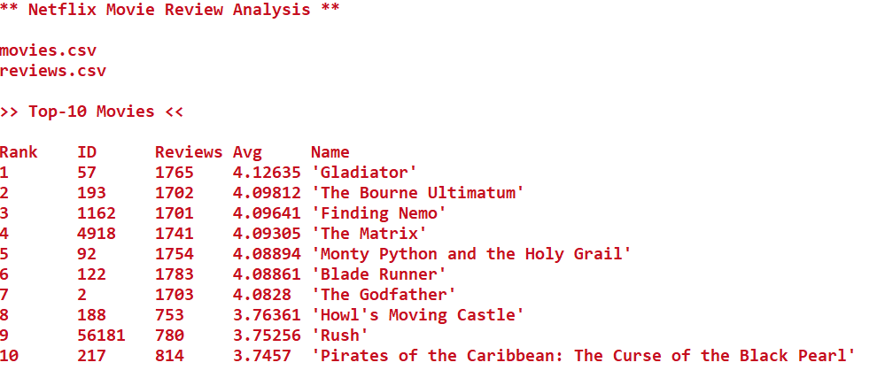
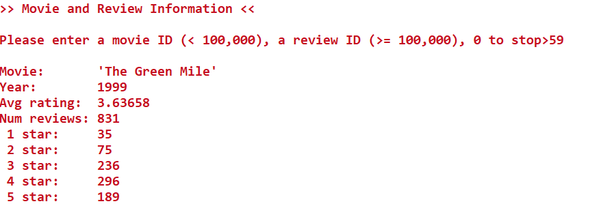

# QuickReviewLookup

A simple CLI program that allows a user to search through thousands of Netflix movie reviews and ratings. The main challenge of this program was implementing an efficient way to parse and organize the enormous data sets. This was done with the help of several (C++ 11) enhancements, including the std::vector and std::map data structures. 
Similar Netflix data sets can be found on Kaggle.com 
 
Program starts out displaying the top 10 movies based on review average.

Displaying the review data for my favorite Tom Hanks movie: The Green Mile 

